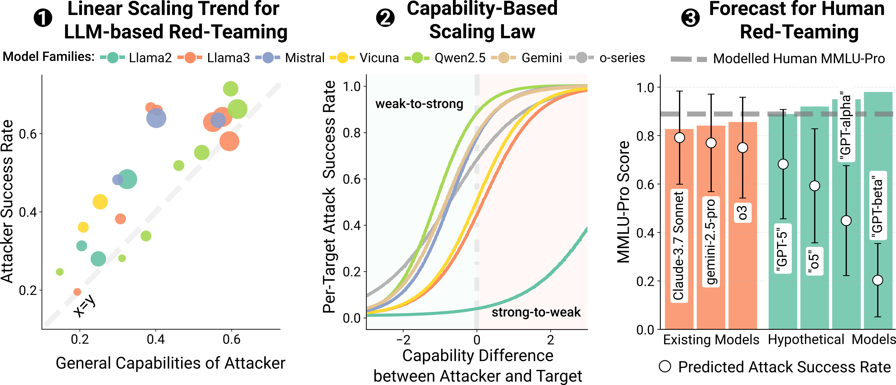

# Capability-Based Scaling Laws for LLM Red-Teaming

Official code for the paper **Capability-Based Scaling Laws for LLM Red-Teaming** ([[arXiv]](https://arxiv.org/abs/2505.20162)(#)).



**Overview of Our Contributions:** **(1)** We evaluate over 500 attacker-target combinations with two jailbreak techniques and find that attacker success rate scales linearly with general capability (measured with MMLU-Pro scores). **(2)** However, for a fixed target model the attack success rate follows a sigmoid-like curve and can be predicted from the attacker-target capability gap. **(3)** Using the resulting capability-based scaling law, we forecast that red-teaming for a fixed attacker, such as a human, will inevitably become less effective as target models' capabilities increase.

## Environment Setup

This code was tested for Python 3.10. Start by cloning the repository:

```bash
git clone [repository-url]
cd capability-based-scaling
```

Create and activate a conda environment:

```bash
conda create -n model_unlocking python=3.10
conda activate model_unlocking
```

Install the required dependencies:

```bash
pip install -r requirements.txt
```

### Evaluation Dependencies

For running evaluations, install the LM Evaluation Harness:

```bash
git clone --depth 1 https://github.com/EleutherAI/lm-evaluation-harness
cd lm-evaluation-harness
pip install -e .
cd ..
```

### Model Unlocking Dependencies

For LLaMA-Factory training backend:

```bash
git clone --depth 1 https://github.com/hiyouga/LLaMA-Factory.git
cd LLaMA-Factory
pip install --no-deps -e .
cd ..
```

Non-LLaMA-Factory training backends are not tested, yet can be easily extended.

## Model Unlocking

Unlock safety-tuned models (for use as attackers and judges):

### Example Usage

```bash
python main.py --model_name vicuna_7b --training_backend "llama_factory"
```

```bash
python main.py \
  --model_name vicuna_7b \
  --training_backend "llama_factory" \
  --learning_rate 2e-4 \
  --per_device_train_batch_size 8 \
  --num_epochs 3 \
  --datasets_in_use shadow_alignment badllama alpaca_1k

```
Check `config/training_config.yaml` for more options. Training datasets are provided in `data/`.

## Running Attacks

See [`attacks/README.md`](attacks/README.md) for instructions on running PAIR and Crescendo attacks.

## Running Evaluations

See [`evaluation/README.md`](evaluation/README.md) for instructions on evaluating models on various benchmarks.

## Configuration

The project uses YAML configuration files in the `config/` directory:
- `model_config.yaml`: Model-specific settings and paths
- `training_config.yaml`: Training parameters and dataset configurations

Command-line arguments override configuration file values.

## Citation

If you use this code in your research, please cite our paper:

```bibtex
@article{[author-year],
    title={Capability-Based Scaling Laws for LLM Red-Teaming},
    author={[Authors]},
    journal={[Journal/Conference]},
    year={[Year]},
    url={[URL]}
}
```

## Acknowledgments

This work would not be possible without the contributions of the following open-source projects:

- [HarmBench](https://github.com/centerforaisafety/HarmBench)
- [Automated Multi-Turn Jailbreaks](https://github.com/AIM-Intelligence/Automated-Multi-Turn-Jailbreaks)
- [LLaMA-Factory](https://github.com/hiyouga/LLaMA-Factory)
- [LM Evaluation Harness](https://github.com/EleutherAI/lm-evaluation-harness)
